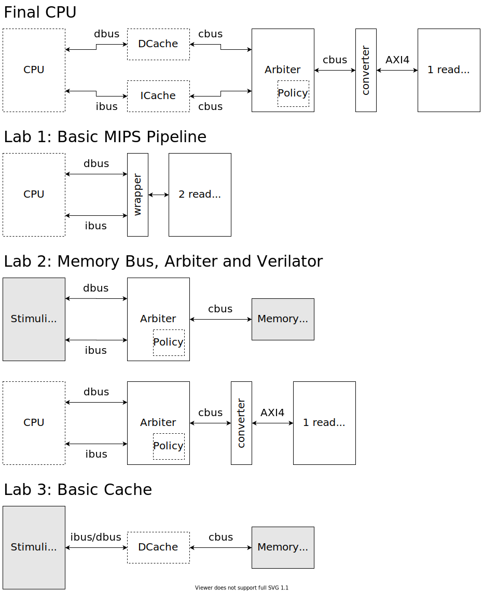

目前还只规划了体系结构部分。操作系统部分还未考虑。如果有需要排在后半个学期。

Vivado 版本：统一 2019.2

五个 Lab：

* 流水线 CPU（3 weeks）
* 总线延时、仲裁（2 weeks）
* Cache（3 weeks，期中之前）
* 开放课题（整个后半个学期）
* 异常处理（？？？）

8 周不够 → 12 周？

测试：

* 龙芯功能测试（所有都要测）
* 龙芯性能测试（在大部分人写完 cache 之后，差不多和开放课题一块放出来）
* 指导同学在 Vivado 手写仿真测试（Lab2、Lab3?）
* Verilator 仿真（Lab2、Lab3）

代码架构：

虚线框表示挖空给同学实现的部分，实线框表示我们实现好的部分。白色背景表示 SystemVerilog，灰色背景表示 C++。

最上面是前三个 Lab 完成后应有的结构 `MyCPU`。接入龙芯的测试时，`MyCPU` 对外暴露一个 AXI4 总线，即把 BRAM 换成龙芯的 SoC。

Lab1 下面的图是 Lab1 功能测试代码的结构，<del>龙芯的功能测试放在 LUTRAM 内，无延时</del>。

Lab2 下面第一张图是在 Verilator 中测试的代码结构，这里只单独测试仲裁器。第二张图是功能测试的代码结构，此时将仲裁部分和 CPU 一块测试。wrapper 用于控制总线延时（比方说增加随机延时）。仲裁（Arbiter）的主体部分由我们提供（或者也丢给他们写？），但是具体策略需要同学自己决定并实现。

Lab3 下面的图是在 Verilator 中单独测试 cache 的代码结构。

每个 Lab 都需要通过功能测试。除了前两个 Lab 外，其余 Lab 测试时都使用 Final CPU 下面展示的结构。后半个学期提供龙芯的性能测试，公开开放课题，以及最后一个 Lab。

Verilator 仅做介绍，不需要大家知道怎么用。在 Lab2 和 Lab3 可以教大家如何在 Vivado 上写模块测试。

ibus、dbus、cbus：<https://github.com/NSCSCC-2020-Fudan/FDU1.1-NSCSCC/blob/master/cache/README.md>

* 会需要做点修改。ibus 保证是 dbus 的子集，以方便直接把 DCache 当 ICache 用。

目前的可以考虑的开放课题：

* 复杂流水线
* 高级 Cache
* 外设和 SoC

开放课题的指标：IPC、主频（Vivado 的布线策略？）、资源使用（总资源利用率）。

外设部分：上面几个指标不太适合这个部分。软件模拟 → 前端（逃

杂项：

* Lab 指导文档、课程主页、课程仓库。
* 每个 Lab 的 DDL 可以拖后。不一定要等上一个 Lab DDL 结束了再讲下一个 Lab，以照顾进度靠后的同学。或者取消迟交扣分，但是只在开放课题中有加分，其余 Lab 只要实现了基本的内容都满分。
* OJ 不做了。工作量有点大。(软工课 PJ

可能的问题：

* Verilator 对 `interface` 支持不是很好，并且我们当时的代码中内存部分也没有用。是否使用 `interface`？目前实验里的内存交互都是双向的，使用 `interface` 和使用结构体相比有什么区别？
* 需要确认 BRAM 是否存在多端口的读写冲突（Lab1）。
* 用 Verilator 做测试需要大家遵守 Verilator 的一些限制。以及是否有必要使用 Verilator 做完整的 CPU 测试（可以方便增加我们自己的性能测试，但是用 Verilator 的话调试手段有限）。Verilator 测试时可能需要限制 cache 大小。