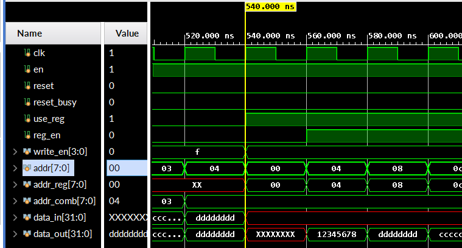
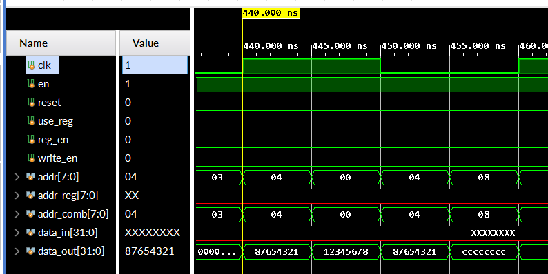
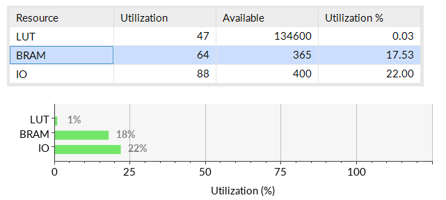
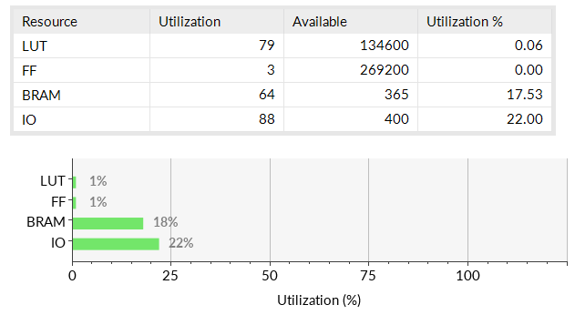
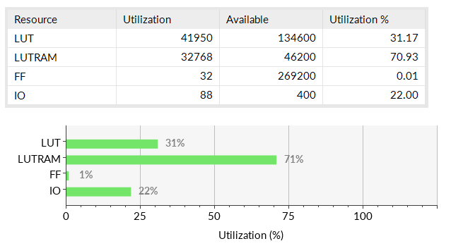
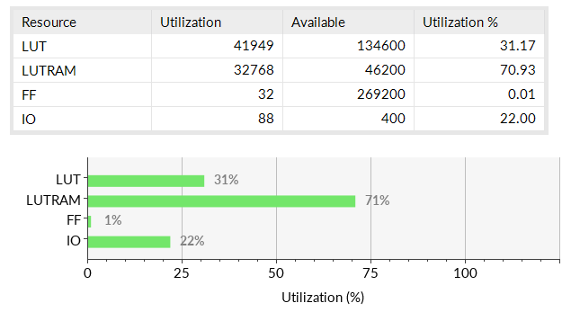
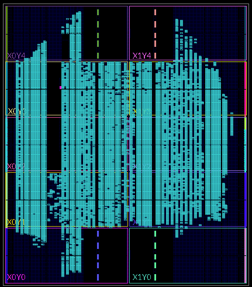
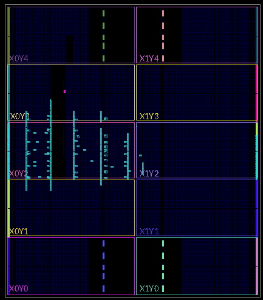

板子上大约有 1.6MByte 的 Block RAM 资源。每个 BRAM 元件大小为 36Kb（~4KB）。

IP 核：“Window” → “IP Catalog”


## BRAM vs LUTRAM

<https://vhdlguru.blogspot.com/2011/01/block-and-distributed-rams-on-xilinx.html>

<https://forums.xilinx.com/t5/Virtex-Family-FPGAs-Archived/Lut-vs-Block-Ram/td-p/251888>

<https://www.quora.com/Which-is-faster-distributed-RAM-or-block-RAM-in-FPGA-1>

大致结论是小存储用寄存器（LUTRAM），大存储用 BRAM。


## BRAM

IP 核：Block Memory Generator

### 特点

* 支持一些乱七八糟的功能（比如 ECC 纠错、AXI 接口）
* 支持 `reset`。Reset 时会有 `reset_busy` 信号输出。
* 支持字节写入。
* 支持读宽度比写宽度大。可能用于 Fetch 阶段抓取多条指令。
  * 尝试过直接设置 read width = 64, write width = 32，但好像读出来的东西和预期有点不符合。
* 地址输入与时钟同步。处理不当会导致晚一个周期读出数据。
  * 请注意提供地址的是否是与时钟同步寄存器。如果是寄存器，可能会导致意外的延时。*这在行为仿真中难以发现*。
* 在 “Write First” 模式下，写入的数据会直接出现在读出端口上，无论地址是否对齐了。
  * 还未测试当读宽度大于写宽度时的情况。
* 默认配置中有一个 “Primitive Output Register”，会导致读取多慢一个周期。
* 当读取地址没有正确对齐时，输出 0。
* 当写入地址没有正确对齐时，写入无效（但写入数据依然会出现在输出）。
* 在行为仿真时，数据输出会有 100ps 的延时。
  * <https://forums.xilinx.com/t5/Simulation-and-Verification/100-ps-delay-for-Block-Memory-Generator-6-3/td-p/219073>

## 测试

BRAM 配置（`test_bram` 模块）：native single-port; byte write enable; byte size = 8; read/write width = 32; read/write depth = 256; write first; no primitive output register; RSTA pin enabled.

Testbench：

```verilog
module BRAMWrap(
    input logic clk, en, reset,
    input logic [3:0] write_en,
    input logic [7:0] addr,
    input logic [31:0] data_in,
    output logic reset_busy,
    output logic [31:0] data_out
);
    test_bram bram_inst(
        .clka(clk), .ena(en), .rsta(reset),
        .wea(write_en),
        .addra(addr),
        .dina(data_in),
        .douta(data_out),
        .rsta_busy(reset_busy)
    );
endmodule

module BRAMWrapTest();
    logic clk = 1;
    always #10 clk <= ~clk;
    
    logic en, reset, reset_busy, use_reg = 0, reg_en = 0;
    logic [3:0] write_en;
    logic [7:0] addr, addr_reg, addr_comb;
    logic [31:0] data_in, data_out;
    BRAMWrap bram(.*);

    initial begin
        en = 1;
        reset = 1;
    #120
        reset = 0;
    #60
        write_en = 4'b1111;
        data_in = 32'h12345678; 
        addr_comb = 0;
    #20
        data_in = 32'h87654321;
        addr_comb = 4;
    #20
        data_in = 32'hcccccccc;
        addr_comb = 8;
    #20
        data_in = 32'hdeadbeef;
        addr_comb = 12;
    #20
        addr_comb = 8'hxx;
        data_in = 32'hxxxx;
        write_en = 4'b0000;
        for (int i = 0; i < 16; i += 4)
            #20 addr_comb = i;
        for (int i = 0; i < 5; i++)
            #20 addr_comb = i;
    #20
        write_en = 4'b1111;
        addr_comb = 1;
        data_in = 32'haaaaaaaa;
    #20
        addr_comb = 2;
        data_in = 32'hbbbbbbbb;
    #20
        addr_comb = 3;
        data_in = 32'hcccccccc;
    #20
        addr_comb = 4;
        data_in = 32'hdddddddd;
    #20
        write_en = 4'b0000;
        data_in = 32'hxxxx;
        use_reg = 1;
    #20
        reg_en = 1;
    end
    
    always_ff @(posedge clk)
    if (reset)
        addr_reg = 32'hxxxxxxxx;
    else if (reg_en)
        addr_reg = addr_reg + 4;
    else if (use_reg)
        addr_reg = 0;

    assign addr = use_reg ? addr_reg : addr_comb;
endmodule
```

### 波形图

读取延迟：



从 540ns 开始，`addr` 换为由 `addr_reg` 这个寄存器提供（`assgin addr = addr_reg`）。当 540ns 时钟上升沿到达时，`addr_reg <= 0`，BRAM 中的地址寄存器也被触发，但是得到的不是 0，而是 `addr_reg` 之前的值。因此 BRAM 在这个周期不会读出数据。

\* *在 XPM 的 Post-Synthesis 和 Post-Implementation 仿真中，这个现象可能不会出现*。*BRAM 没试过*。


## LUTRAM

IP 核：Distributed Memory Generator 

### 特点

* 功能还没我们的寄存器文件强大。
  * *除了它可以用外部文件初始化外*。
* 非常正常的接口。
* 不支持全局 reset。
* 不支持读宽度大于写宽度。
* 可定制的大小不如 BRAM。
* 读逻辑是组合逻辑，不需要与时钟同步。
* 在仿真时没有读取 100ps 延时。
* 非对齐写入、读取的行为和 “Write First” 模式的 BRAM 一致。
  * 非对齐读取输出 0。
  * 非对齐写入无效。
  * 写入数据会出现在读取端口。
    * 未测试当写入不与时钟同步时的情况。

### 测试

LUTRAM 配置（`test_lutram` 模块）：single port; depth = 256; data width = 32; 

Testbench：

```verilog
module LUTRAMWrap(
    input logic clk, write_en,
    input logic [7:0] addr,
    input logic [31:0] data_in,
    output logic [31:0] data_out
);
    test_lutram lutram_inst(
        .clk(clk), .we(write_en),
        .a(addr), .d(data_in),
        .spo(data_out)
    );
endmodule

module LUTRAMWrapTest();
    logic clk = 1;
    always #10 clk <= ~clk;

    logic en, reset, use_reg = 0, reg_en = 0;
    logic write_en;
    logic [7:0] addr, addr_reg, addr_comb;
    logic [31:0] data_in, data_out;
    LUTRAMWrap lutram(.*);

    initial begin
        en = 1;
        reset = 1;
    #120
        reset = 0;
    #60
        write_en = 1;
        data_in = 32'h12345678; 
        addr_comb = 0;
    #20
        data_in = 32'h87654321;
        addr_comb = 4;
    #20
        data_in = 32'hcccccccc;
        addr_comb = 8;
    #20
        data_in = 32'hdeadbeef;
        addr_comb = 12;
    #20
        addr_comb = 8'hxx;
        data_in = 32'hxxxx;
        write_en = 0;
        for (int i = 0; i < 16; i += 4)
            #20 addr_comb = i;
        for (int i = 0; i < 5; i++)
            #20 addr_comb = i;
        for (int i = 0; i < 16; i += 4)
            #5 addr_comb = i;
    #20
        write_en = 1;
        addr_comb = 1;
        data_in = 32'haaaaaaaa;
    #20
        addr_comb = 2;
        data_in = 32'hbbbbbbbb;
    #20
        addr_comb = 3;
        data_in = 32'hcccccccc;
    #20
        addr_comb = 4;
        data_in = 32'hdddddddd;
    #20
        write_en = 0;
        data_in = 32'hxxxx;
        use_reg = 1;
    #20
        reg_en = 1;
    end
    
    always_ff @(posedge clk)
    if (reset)
        addr_reg = 32'hxxxxxxxx;
    else if (reg_en)
        addr_reg = addr_reg + 4;
    else if (use_reg)
        addr_reg = 0;

    assign addr = use_reg ? addr_reg : addr_comb;
endmodule
```

### 波形图

异步读取：




## Xilinx Parameterized Macros

XPM 我是从 NonTrivialMIPS 的报告中看到的。Xilinx 提供了 “UltraScale Architecture Libraries Guide”，里面有 XPM 的文档。XPM 中提供了 `xpm_memory_*`，功能和 Block Memory Generator 提供的类似，但是有很多细节上的不同。

该 XPM 使用模块参数对 RAM 进行设置。与 IP 核的定制相比，XPM 没有重新构建的过程，只需要改几行代码就可以完成定制。并且可以通过参数来决定是使用 BRAM 还是 LUTRAM（Distributed RAM），不需要使用两个不同的 IP 核。

**NOTE**: When using the non-project flow, **you must issue the `auto_detect_xpm` command**.

### 特点


* 要求读端口和写端口宽度必须一样。
* Distributed RAM 只支持 “Read First” 模式。
* 当配置不合法时会在 Simulation 中报错。
* Distributed RAM 支持无延迟读取，BRAM 读取最少一周期延时。
* 对于双端口 BRAM，不允许在同一个时钟周期上升沿同时读写同一个地址。

### 硬件资源

以实例化一个 256KB 的 RAM 为例，看一下它们对硬件资源的消耗。实例化 XPM 模块的代码如下：

```verilog
// xpm_memory_spram: Single Port RAM
// Xilinx Parameterized Macro, version 2019.2
xpm_memory_spram #(
    .ADDR_WIDTH_A(16),  // 地址宽度
   	.AUTO_SLEEP_TIME(0),
   	.BYTE_WRITE_WIDTH_A(8),
   	.CASCADE_HEIGHT(0),
   	.ECC_MODE("no_ecc"),
   	.MEMORY_INIT_FILE("none"),
   	.MEMORY_INIT_PARAM("0"),
   	.MEMORY_OPTIMIZATION("true"),
    .MEMORY_PRIMITIVE("distributed"),  // 内存类型。"block"/"distributed"
    .MEMORY_SIZE(2097152),  //  2097152 = 65536 * 4 * 8 (bits)，即 256KB
   	.MESSAGE_CONTROL(0),
   	.READ_DATA_WIDTH_A(32),
    .READ_LATENCY_A(1),  // 读取有一周期延时
   	.READ_RESET_VALUE_A("0"),
   	.RST_MODE_A("SYNC"),
   	.SIM_ASSERT_CHK(1),
   	.USE_MEM_INIT(1),
   	.WAKEUP_TIME("disable_sleep"),
   	.WRITE_DATA_WIDTH_A(32),
    .WRITE_MODE_A("read_first")  // Distributed RAM 只支持 “Read First” 模式
)
xpm_memory_spram_inst (
   .douta(data_out),
   .addra(addr),
   .clka(clk),
   .dina(data_in),
   .ena(en),
   .injectdbiterra(0),
   .injectsbiterra(0),
   .regcea(1),
   .rsta(reset),
   .sleep(0),
   .wea(write_en)
);
// End of xpm_memory_spram_inst instantiation
```

#### BRAM

Synthesis Summary:



Implementation Summary:



可见  BRAM 对于 256KB 的内存还是比较充足的。

#### LUTRAM

Synthesis Summary:



Implementation Summary:



用 LUTRAM 的后果就是会占用大量的 LUT 资源。与 BRAM 相比，LUTRAM 资源较少，并且可以看到还有很多的 LUT 资源也被占用。

最后放一张 LUTRAM 实现后的资源图：



对比一下 BRAM 的：

